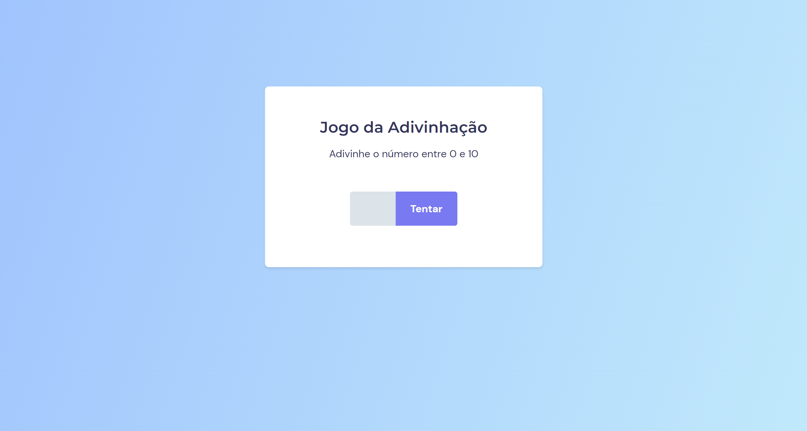

# Jogo da Adivinhação

> Trilha Explorer 🚀

💜 Desafio do Programa Explorer da Rocketseat - Stage 5

🔗[Clique aqui para acessar](https://gksouza.github.io/jogo-adivinha/)

## 🔰 Tecnologias

- HTML
- CSS
- JavaScript
- Git e Github

## 📚 Meu aprendizado

Nesse desafio adquiri conhecimentos avançados na programação Web com JavaScript, ES6 Modules, criei objetos com padrão Factory e injeção de dependências.

## 🤸‍♀️ Contato

https://www.linkedin.com/in/gkos22/

e-mail: gkoliver2020@gmail.com